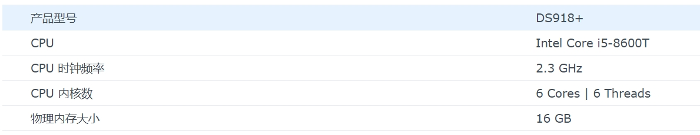
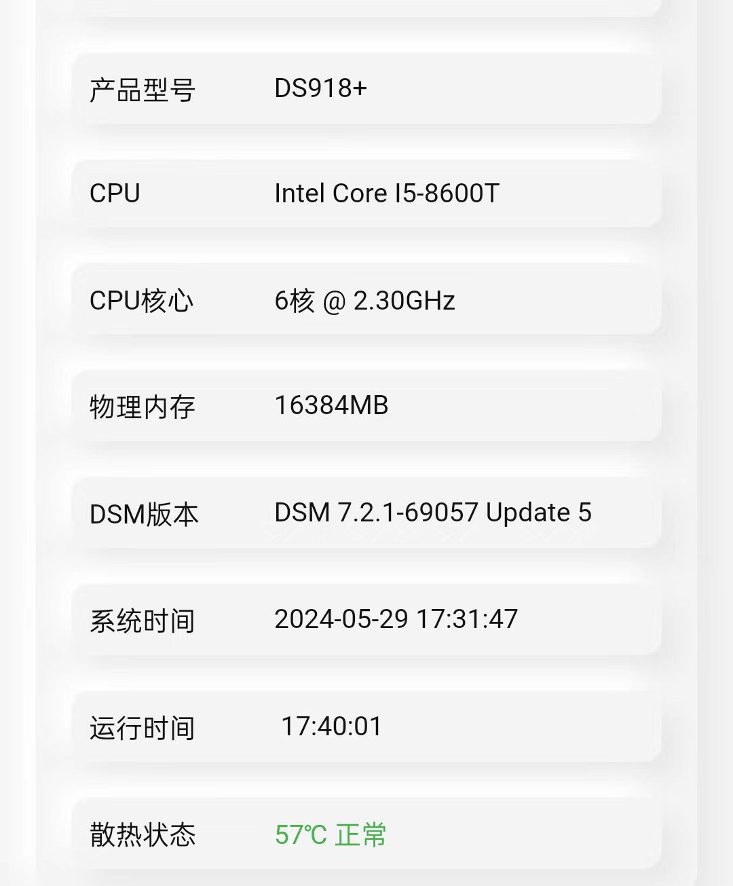
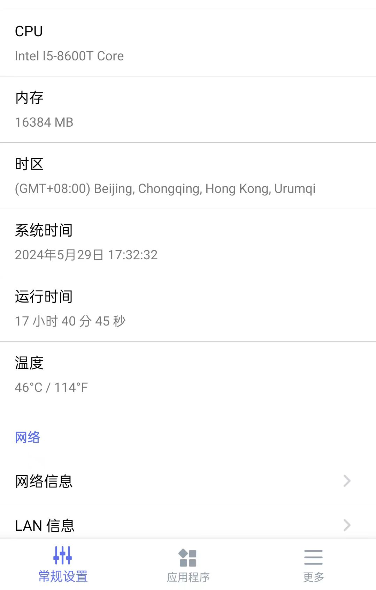
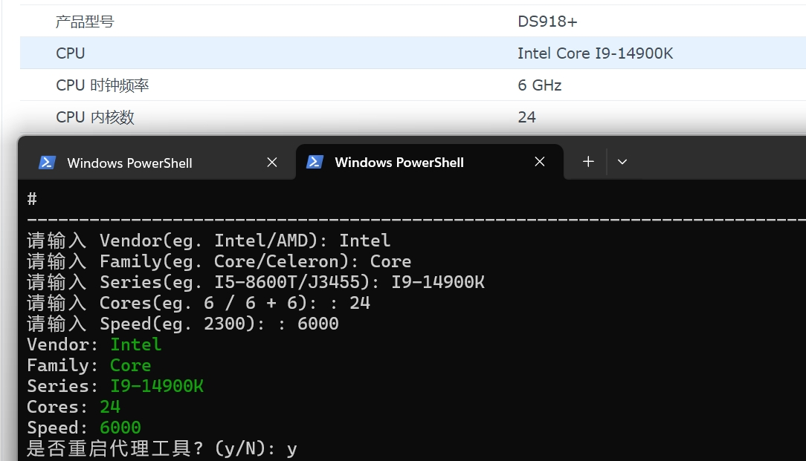
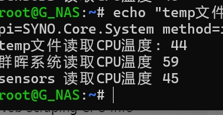

# 自用黑群 CPU 硬件信息及真实温度显示

## 简介

显示系统的真实 CPU 信息和温度。修改nginx配置反代后端并通过读取系统硬件信息，将CPU型号以及温度信息嵌入到目标数据流中。(支持自定义CPU型号)

## 功能

- 通过 /proc/cpuinfo 读取真实的 CPU 厂商、系列、核心数、时钟频率信息。
- 通过 /sys/class/thermal/thermal_zone0/temp 文件读取当前的CPU温度。
- 将处理后的数据写入到目标输出中。

## 实现原理

工具通过以下步骤实现功能：

1. **设置代理**：监听 SCGI 套接字请求并更改nginx.conf后端服务器地址
1. **数据读取**：接收客户端请求转发至后端,读取数据并进行处理。
3. **数据替换**：替换数据中的特定字段，将实际的 CPU 信息和系统温度嵌入到数据中。
4. **数据写入**：将修改后的数据写入到客户端。

## 如何使用
1. 启用SSH终端并登录
2. 切换到root权限
```bash
    sudo -i
```
3. 执行一键安装脚本
```bash
    bash <(curl -sSL https://mirror.ghproxy.com/https://raw.githubusercontent.com/GroverLau/syno_cpuinfo/main/syno_cpuinfo.sh)
```
## 附加功能
1. 修改CPU型号(已安装):
```bash
   bash <(curl -sSL https://mirror.ghproxy.com/https://raw.githubusercontent.com/GroverLau/syno_cpuinfo/main/syno_cpuinfo.sh) edit
```
2. 卸载:
```bash
   bash <(curl -sSL https://mirror.ghproxy.com/https://raw.githubusercontent.com/GroverLau/syno_cpuinfo/main/syno_cpuinfo.sh) uninstall
   ```

# 截图展示

## 信息中心


## 群晖助手


## 群晖管家


## 自定义型号


## 测试使用不同方式获取温度

